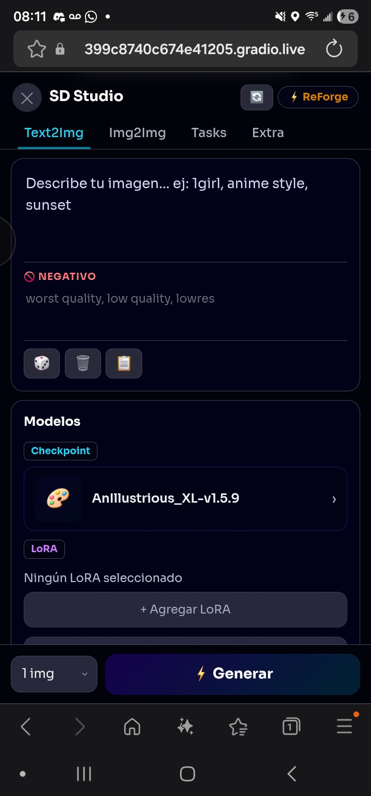
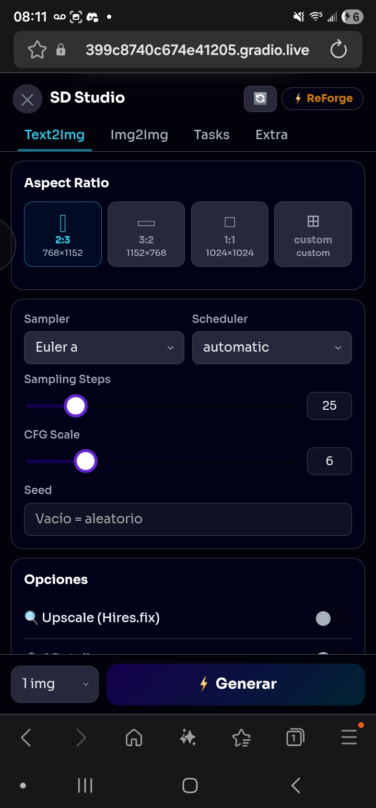
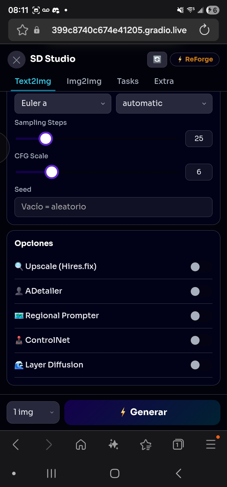
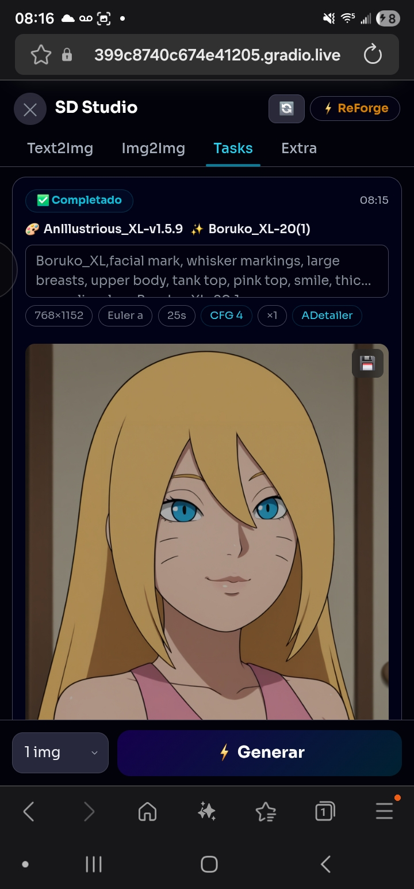

# 📱 Mobile UI Extension

### Stable Diffusion WebUI (Forge / Automatic1111)

A mobile interface inspired by **tensor.art** for SD WebUI Forge and AUTOMATIC1111.

---

## ✨ Features

* 📱 **Full mobile interface** — Dark design inspired by tensor.art
* 🎨 **Text2Img** — Positive/negative prompt with toolbar (random, clear, copy)
* 🖼️ **Img2Img** — Image upload for variations
* ⚙️ **Settings** — Aspect ratio (2:3, 3:2, 1:1, custom), steps, CFG, seed, sampler
* 🔧 **Models** — Checkpoint selector with hot swapping
* ✨ **LoRA** — Selector with slider weight control
* 🔄 **Real-time progress** — Progress bar during generation
* 🖼️ **Results gallery** — View generated images
* 🔍 **Upscale / ADetailer / Layer Diffusion** — Quick toggles
* 🎲 **Random prompt** — Built-in prompt ideas

---

## 🚀 Installation

### Method 1 — Install from URL (recommended)

1. Open SD WebUI
2. Go to **Extensions** → **Install from URL**
3. Paste the repository URL
4. Click **Install**
5. Restart the WebUI

### Method 2 — Manual

1. Download or clone this repository
2. Copy the `mobile-ui-extension` folder to:

   ```
   stable-diffusion-webui/extensions/mobile-ui-extension/
   ```
3. Restart the WebUI

---

## 📁 Repository Structure

```
mobile-ui-extension/
├── scripts/
│   └── mobile_ui.py          # Main script (Python/Gradio)
├── javascript/
│   └── mobile_ui.js          # Full UI (auto-injected)
└── README.md
```

---

## 🎮 Usage

1. After installation, you will see a **📱 Mobile UI** button in the bottom-right corner
2. Click it to open the mobile interface in full screen
3. Enter your prompt, adjust settings, and press **⚡ Generate**
4. Images will appear in the results gallery

---

## ⚙️ Compatibility

| WebUI               | Status           |
| ------------------- | ---------------- |
| Forge               | ✅ Tested         |
| AUTOMATIC1111 v1.9+ | ✅ Compatible     |
| ComfyUI             | ❌ Not compatible |

---

## 🛠️ Technology

* Vanilla JavaScript (no external dependencies)
* Uses the **A1111 REST API** (`/sdapi/v1/`)
* Font: [Sora](https://fonts.google.com/specimen/Sora) via Google Fonts
* No React, no bundler — runs directly

---

## 📝 Notes

* The extension **does not replace** the original interface — it adds it as an overlay
* Model switching may take time depending on checkpoint size
* Compatible with extensions like ADetailer (toggles enable parameters in the payload)

---

## 🐛 Known Issues

* The Img2Img tab is under development (UI ready, functionality pending)
* Layer Diffusion requires the extension to be installed in the WebUI

---

*Developed as a Stable Diffusion WebUI extension*

---

## Preview






---

## ☕ Support the project

If this extension saves you time and you'd like to support its development, a coffee is always appreciated!

[](https://ko-fi.com/danielgs20019)

Every contribution helps keep the project maintained and motivates new features. Thank you! 🙏

